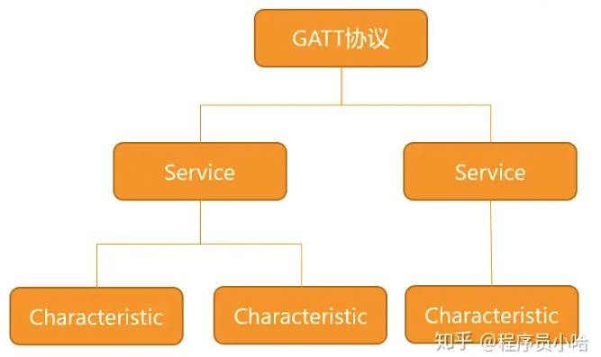

该项目为了测试 GY61 磁力计的使用，修正 GPS 的航向角。

ai Promot
```
Q:2 个 ESP32单片机之间 2 米内的数据传输用蓝牙好还是 wifi好？我想实现一个单片机收集加工 gps,陀螺仪等传感器数据，另一个使用 tft仪表进行显示。

A:对于在2米范围内的数据传输，通常来说蓝牙是更适合的选择。蓝牙具有低功耗、短距离传输、稳定连接等特点，非常适合用于两个设备之间的数据传输，尤其是在近距离内进行数据传输时。
对于您的应用需求来说，两个ESP32单片机之间的数据传输选择蓝牙可能更加适合，因为蓝牙的低功耗特点可以节省设备能耗，同时可以保持稳定的连接传输数据。
如果您选择使用WiFi，通常用于长距离数据传输，而且连接稳定性可能受到一定影响，如果您只是在2米范围内传输数据，选择蓝牙可能更加合适。
```


### 蓝牙技术

 - BLE?

    一般将蓝牙3.0之前的BR/EDR蓝牙称为传统蓝牙（经典蓝牙BT：BlueTooth），而将蓝牙4.0规范下的LE蓝牙称为低功耗蓝牙。
    BLE技术采用非常快速的连接方式，因此可以处于“非连接”状态（节省能源），此时链路两端相互间只是知晓对方，只有在必要时才开启链路，然后在尽可能短的时间内关闭链路--这样设计的目的就是为了低功耗。
    BLE优点：搜索速度快、连接速度快、超低功耗保持连接和传输数据，缺点是，传输速率低。
    
    BLE数据通讯:
    - GATT
    

    一个Gatt包含多个服务（Service）；一个服务包含多个特征（Characteristic）；一个特征包含多个描述符（Descriptor）；
    
    蓝牙连接成功之后，数据的传输是对特征值（Characteristic）这个参数进行读，写，通知等操作；

    为了方便管理，我们可能有不止一个特征值（Characteristic），我们可以根据需要创建多个特征值，比如一个特征值是记录环境温度的值，一个特征值是记录设备的温度值，等等。

